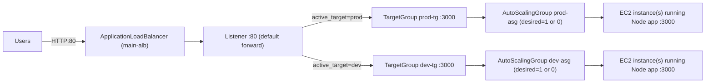

# Blue/Green (prod/dev) Deployment with AWS ALB + Terraform

Blue/green style deployment for a Node.js (Express) app using **AWS Application Load Balancer (ALB)**, **Auto Scaling Groups (ASG)**, **Terraform**, and a **GitHub Actions** workflow to switch between environments.

## Overview

| Feature | Description |
|---|---|
| **Two environments** | `prod` and `dev` exist together; only one receives traffic |
| **Fast switch / rollback** | Change `active_target` and apply |
| **IaC** | Networking, ALB, target groups, ASGs, launch templates via Terraform |
| **CI/CD (optional)** | GitHub Actions `workflow_dispatch` to select `prod` or `dev` |

## Architecture (Mermaid)



### How switching works

- `terraform/listener.tf` forwards ALB traffic based on `active_target`.
- `terraform/autoscaling.tf` scales:
  - `prod-asg` to `1` when `active_target=prod` else `0`
  - `dev-asg` to `1` when `active_target=dev` else `0`

## App endpoints

The target group health check uses `/` (see `terraform/target-groups.tf`).

| Endpoint | Purpose |
|---|---|
| `/` | ALB health check (returns JSON) |
| `/v2/health` | API health check (returns JSON) |
| `/v2/hello` | Sample endpoint |

## Project structure

```
├── .github/workflows/
│   └── deploy.yaml              # workflow_dispatch: choose prod/dev
├── app/
│   ├── app.js                   # Express app (port 3000)
│   └── package.json             # Express dependency + start script
├── terraform/
│   ├── main.tf                  # VPC, IGW, subnets, security groups
│   ├── alb.tf                   # ALB
│   ├── listener.tf              # Listener (forwards based on active_target)
│   ├── target-groups.tf         # prod/dev TGs (port 3000, health check /)
│   ├── autoscaling.tf           # prod/dev ASGs (desired capacity toggled)
│   ├── launch-templates.tf      # user_data installs Node + runs systemd service
│   ├── variable.tf              # region, vpc_cidr, subnet_cidrs, active_target
│   ├── outputs.tf               # alb_dns_name, app_url, active_target
│   ├── provider.tf              # AWS provider
│   └── backend.hcl.example      # backend config template
├── DEPLOYMENT_GUIDE.md
└── README.md
```

## Prerequisites

| Requirement | Notes |
|---|---|
| AWS account | VPC/EC2/ALB/ASG/S3 permissions |
| Terraform | v1.6+ |
| AWS CLI | `aws configure` set up |
| S3 bucket | Terraform remote state (recommended; required for GitHub Actions) |
| GitHub repo access from EC2 | If the repo is private, user-data `git clone` fails and targets will be unhealthy |

### Branch behavior (important)

Your EC2 instances download code at boot via `terraform/launch-templates.tf`:
- **prod** instances clone branch `main`
- **dev** instances clone branch `dev`

If you push changes to `dev` but deploy prod, prod instances will still clone `main`.

## Deploy (local)

### 1) Create an S3 bucket for Terraform state (one-time)

```bash
aws s3 mb s3://your-unique-bucket-name --region us-east-1
aws s3api put-bucket-versioning --bucket your-unique-bucket-name --versioning-configuration Status=Enabled
```

### 2) Terraform init

```bash
cd terraform
terraform init \
  -backend-config="bucket=your-unique-bucket-name" \
  -backend-config="key=prod-dev/terraform.tfstate" \
  -backend-config="region=us-east-1"
```

### 3) Deploy prod (or dev)

```bash
terraform apply -auto-approve -var="active_target=prod"
```

Switch later:

```bash
terraform apply -auto-approve -var="active_target=dev"
```

### 4) Get the ALB URL

```bash
terraform output -raw app_url
```

## GitHub Actions deployment

The workflow in `.github/workflows/deploy.yaml` runs Terraform with `active_target` set from the workflow input.

### Required secrets

| Secret | Required | Notes |
|---|---:|---|
| `AWS_ACCESS_KEY_ID` | yes | IAM user access key |
| `AWS_SECRET_ACCESS_KEY` | yes | IAM user secret key |
| `AWS_REGION` | yes | used by `configure-aws-credentials` |
| `TF_STATE_BUCKET` | yes | S3 bucket for Terraform state |
| `TF_STATE_KEY` | no | defaults to `prod-dev/terraform.tfstate` |

## Troubleshooting

### 502 Bad Gateway / targets unhealthy

Usually means **no healthy targets**. Check target health in AWS Console, then on the instance:

```bash
sudo cat /var/log/user-data.log
sudo systemctl status nodeapp --no-pager
curl -sS http://127.0.0.1:3000/
```

### `git clone` fails in user-data

If your repo is private (or the branch doesn’t exist), user-data can’t clone and the service never starts. Make the repo public or switch to an authenticated clone method.

## Clean up

```bash
cd terraform
terraform destroy -auto-approve -var="active_target=prod"
```
